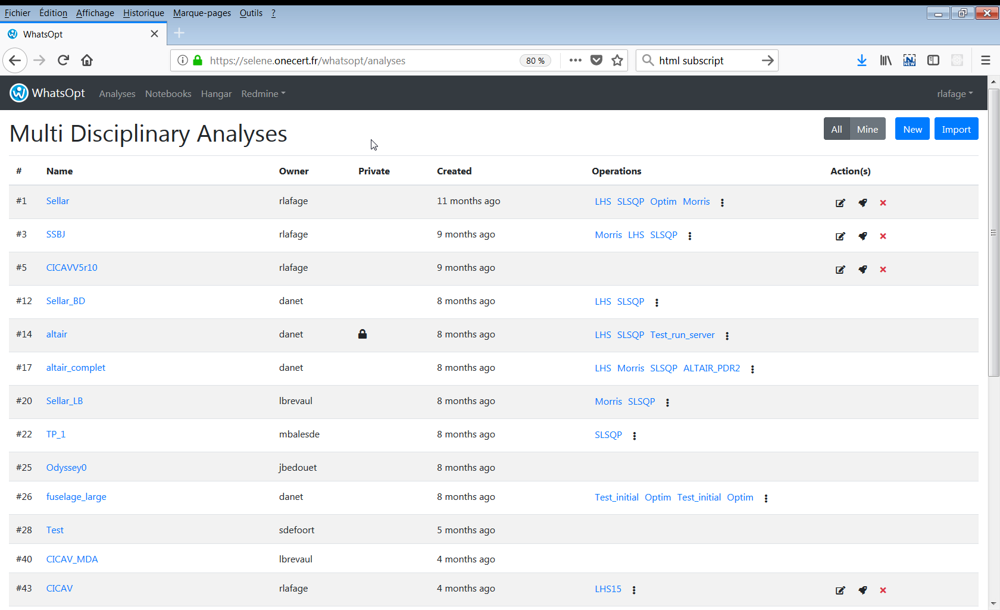
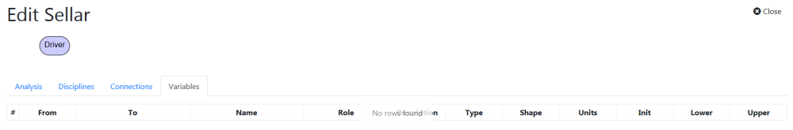
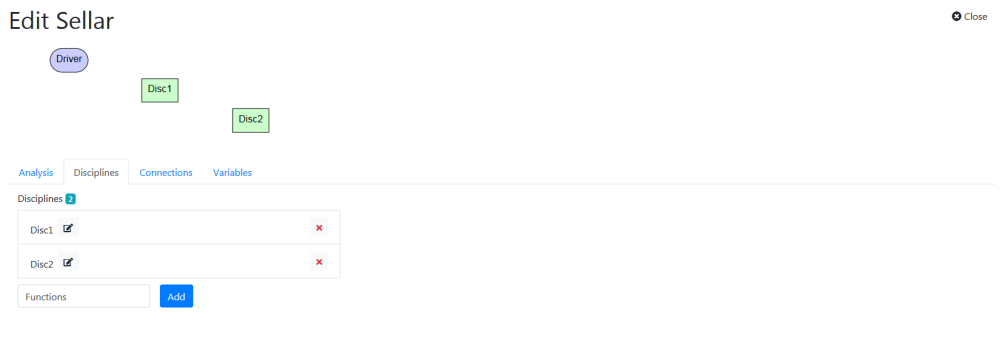
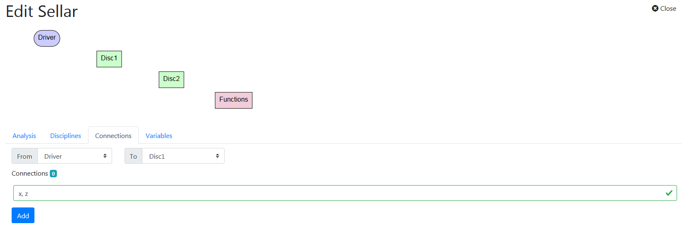
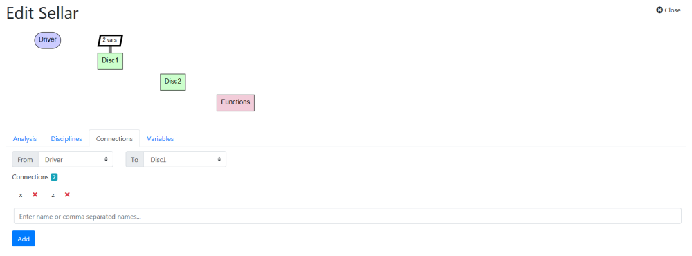
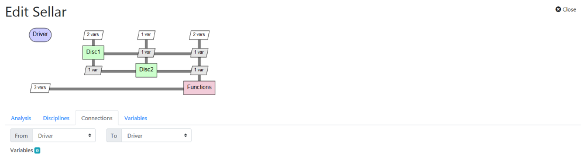
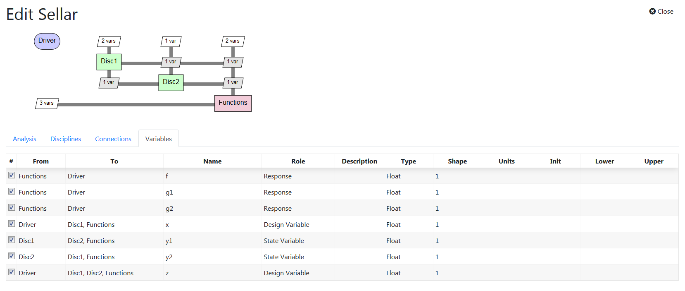
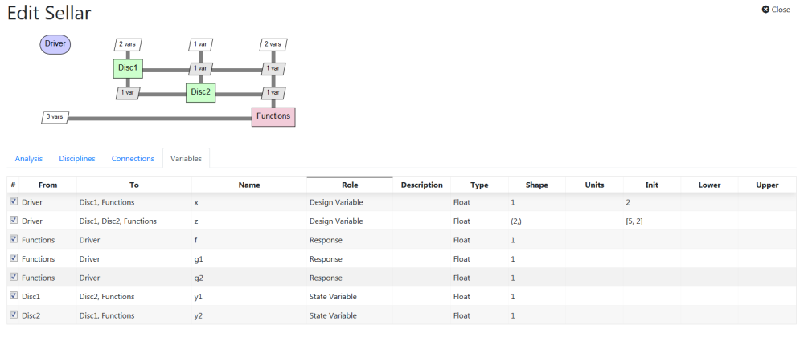

# WhatsOpt tutorial - Part 1

## Installation

### Prerequisites

Install [OpenMDAO](http://openmdao.org/) 3.0+ required 

```shell
pip install openmdao 
```

### WhatsOpt command line installation

```shell
pip install wop
```

You can test with


```python
wop --version
```

    wop, version 1.19.1
    

## Sellar Analysis Creation

Open your favourite web browser (Firefox recommended) and navigate to the _WhatsOpt server url_. If you are not already logged in, you land on the log in page. Once you are logged in you see the Analyses page.



We are going to create the [Sellar analysis](https://arc.aiaa.org/doi/abs/10.2514/6.1996-714) which is kind-of the "hello world" of the MDAO domain. The figure below is copied from [OpenMDAO tutorial](https://openmdao.org/newdocs/versions/latest/basic_user_guide/multidisciplinary_optimization/sellar.html?highlight=sellar). In our analysis below, we will group the <code>Objective</code> and <code>Contraint</code> components in one single component named <code>Functions</code>.


a. 0n the Analyses page, create a new analysis by clicking on the "New" button.
Enter the name of the New Analysis. The WhatsOpt convention here is to use a CamelCase name, let say: <code>Sellar</code>.


b. Once you clicked Submit button, you arrive on the edition page of the analysis which is empty at the moment. Below the title the [XDSM](https://mdolab.engin.umich.edu/wiki/xdsm-overview) diagram is for the moment displayed with a single component named Driver which represent the user of the analysis (directly the actual user if he or she runs tha analysis once or indirectly through the usage of an optimizer [XXX] or a design of experiment runner [XXX]). AT the bottom there are four tabs : <code>Analysis</code>, <code>Disciplines</code>, <code>Connections</code>, <code>Variables</code>, the latter one is displayed as a default. We can see there is no variable for the moment (no rows in the table).

Note: <strong>All screenshots were made with XDSM v1 standard, since then WhatsOpt uses XDSM v2 (which mainly differs by using less flashy colors).</strong>  



c. Click on the Analysis tab. Here you can update the name of your analysis or restrict access to your analysis.



d. As we are happy with the current analysis name we click on the second tab named <code>Disciplines</code>. On this tab, we can enter the disciplines of our analysis. Successivly we enter three names in the textfield: <code>Disc1</code> (press _Enter_), <code>Disc2</code> (press _Enter_), <code>Functions</code> (press _Enter_). WhatsOpt convention here is also to have CamelCase names. Note you can use a single underscore to display following text as subscript (e.g. Disc_1 will be displayed as <code>Disc<sub>1</sub></code> in the XDSM).

e. For <code>Functions</code>, we can click on the edit button next to the label, select the <code>Function</code> type and update. This action is just aesthetic to inform that this component is not a true discipline code but rather a set of functions used to compute some quantities from true disciplines outputs (actually the true multi-disciplinary analysis is only composed with <code>Disc1</code> and <code>Disc2</code>.

Note: <strong>The cosmetic distinction between discipline and functions was removed with XDSM v2.</strong>


Note that you can drag and drop disciplines to change their order in the list or delete a discipline by clicking on the cross button on the right.

f. After entering our disciplines, we can move on <code>Connections</code> tab where we will enter so called connections between disciplines. Those connections are created by selecting 'from discipline' and 'to discipline' and entering comma-separated list of variable names. WhatsOpt convention is to une snake_case for such names. 

On the _to_ discipline selector, you select <code>Disc1</code>.

On the texfield you enter <code>x, z</code> then press _enter_. 



You've just created two variable connections between the <code>Driver</code> and <code>Disc1</code> (the Driver feeds Disc1 with 2 variables names x and z). Those connections are reflected in the XDSM diagram.



Notes: 
  * when you select a diagonal component (i.e. a discipline) in the XDSM is border is hihglighted and you can see its inputs and outputs.
  * when you select an off-diagonal component (i.e. connections) the variables are listed and can be deleted by pressing the corresponding cross button.
  * To unselect, click again on the selected element.

g. Successively, you keep on selecting and typing:
  * From: <code>Driver</code>, To: <code>Disc2</code>, enter <code>x</code>, then press _Enter_
  * From: <code>Driver</code>, To: <code>Functions</code>, enter <code>x, z</code>, then press _Enter_
  * From: <code>Disc1</code>, To: <code>Disc2</code>, enter <code>y1</code>, then press _Enter_
  * From: <code>Disc1</code>, To: <code>Functions</code>, enter <code>y1</code>, then press _Enter_
  * From: <code>Disc2</code>, To: <code>Functions</code>, enter <code>y2</code>, then press _Enter_
  * From: <code>Disc2</code>, To: <code>Disc1</code>, enter <code>y2</code>, then press _Enter_
  * From: <code>Functions</code>, To: <code>Driver</code>, enter <code>f, g1, g2</code>, then press _Enter_
    
You finally get the following XDSM.


    

h. You've entered all the connections, you can move on the Variables tab and see that the table is now filled with the variables you've just entered. Each line contains information about a variable, the table columns are :
  * _checkbox_: that checkbox allows to deactivate a variable. You know that you're not going to use it bu you want to keep the information and reactivate it later on.
  * _From_ : Discipline that produce the variable (always uniq).
  * _To_: Disciplines that consumes the variable.
  * _Name_: the name of the variable
  * _Role_: the role of a variable. As a default, variables produced by Driver are design variables, variables consumed by the Driver are responses, others are state variables.
  * _Description_: short description of the variable (empty by default)
  * _Type_: Float by default, can be Integer or String but at the code generation level only Float are supported. 
  * _Shape_: can be either 1 (meaning scalar), (n,), (n, m), (n, m, p) or (n, m, p, q) Python shape
  * _Units_: text representing units used for the variable quantity.
  * _Init_: Initial value (default to 1.0 if empty). 
  * _Lower_: Lower bound of the variable quantity (only used for design variables)  
  * _Upper_: Upper bound of the variable quantity (only used for design variables)



Notes:
  * when you select a component the table is updated accordingly showing only the relevant variables
  * ordering is available by clicking on the headers of the columns
  * with the leading checkbox on, the columns from _Name_ to _Upper_ are editable

i. To implement Sellar analysis properly we have to set <code>z</code> as being a vector of size 2. 
So you click on the shape column of the <code>z</code> variable and set its shape to <code>(2,)</code>.


We can also initialize the design variables :
  * select the _Init_ cell of the <code>x</code> variable and set it to <code>2</code>.
  * select the _Init_ cell of the <code>z</code> variable and set it to <code>[5, 2]</code>.

As for now, there is no check on the compatibility between the values and type/shape you enter at WhatsOpt level. Actually the checking will be done later on at runtime when you will run the generated code.


