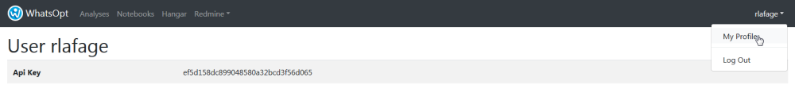
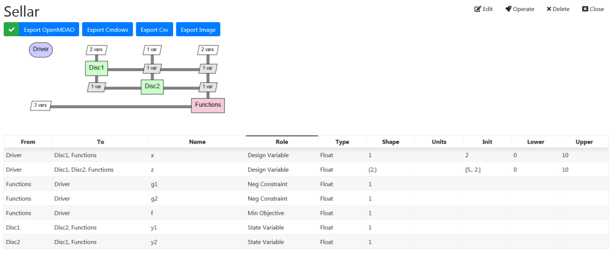
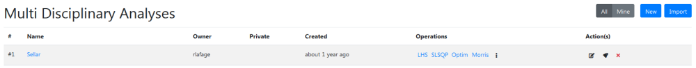
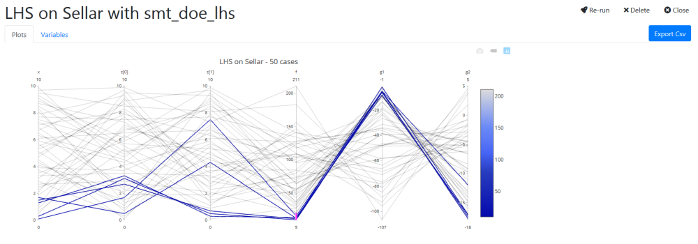
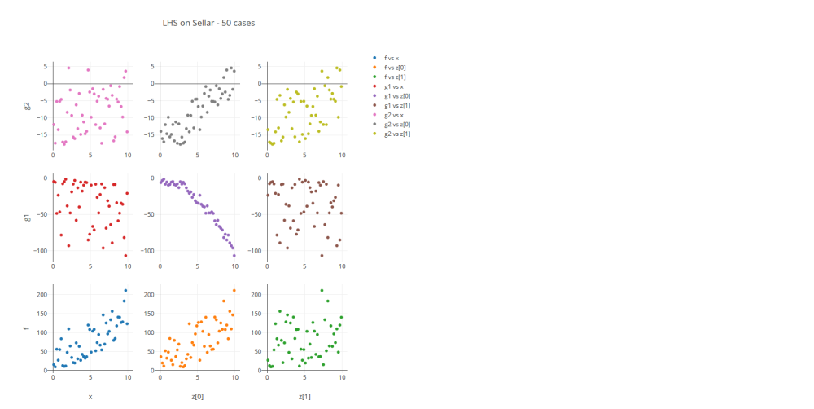
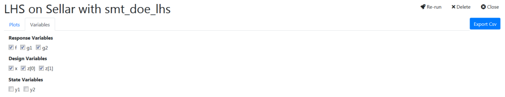
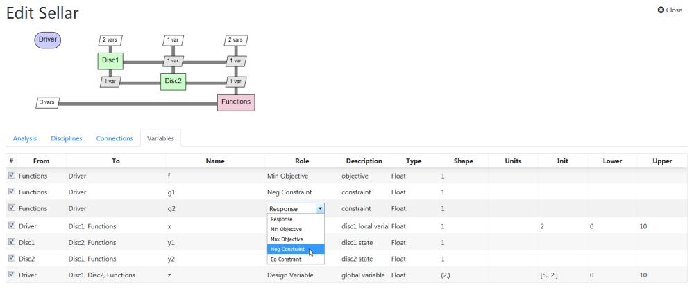
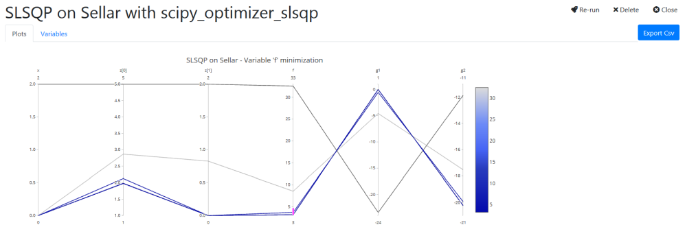
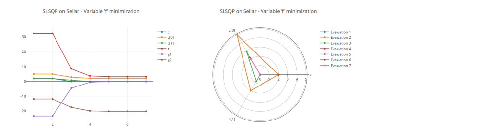

# WhatsOpt Tutorial - Part 2

## Command _wop_ and OpenMDAO code generation

### Sellar analysis implementation and execution

a. Open a shell/command window and log in WhatsOpt with the following command

```bash
> wop login <WhatsOpt server url>
```

With our Onera external server, it gives:

```bash
> wop login https://ether.onera.fr/whatsopt
```

If you're not already logged in, the previous command will issue the following text 

```bash
wop login https://ether.onera.fr/whatsopt
You have to set your API key.
You can get it in your profile page on WhatsOpt (https://ether.onera.fr/whatsopt).
Please, copy/paste your API key below then hit return (characters are hidden).
Your API key:
```

As explained, you have to go on the WhatsOpt application to get your api key in your profile (_username_ > _Profile_).



Just copy and paste the key in the command windows (Note that characters are not shown). The login command should succeed with the following message.

<pre>
Successfully logged into WhatsOpt (https://selene.onecert.fr/whatsopt)
</pre>

b. You can now list the available analyses with the <code>wop list</code> command:

```bash
> wop list
  id  name         created at
----  -----------  ------------------------
   1  Group        2019-01-01T21:50:11.810Z
  18  SellarOptim  2019-01-06T16:03:28.511Z
  20  CicavMda     2019-02-01T22:16:35.512Z
  24  Sellar       2019-02-03T08:23:11.043Z
```

Note: The list here is an example, you probably have another one.

c. You are ready to generate OpenMDAO code. 
First, create a directory, let say <code>sellar</code>, and cd in this directory:

```bash
> mkdir sellar
> cd sellar
```

then find out the id of the analysis you want to get and generate the code with the <code>wop pull</code> command:

```bash
> wop pull 24
(base) D:\rlafage\sellar>wop pull 24
Pull disc1.py
Pull disc1_base.py
    Pull disc2.py<
Pull disc2_base.py
Pull functions.py
Pull functions_base.py
Pull sellar.py
Pull sellar_base.py
Pull __init__.py
Pull run_mda.py
Analysis 24 pulled
```

For each discipline and the analysis itself two files are generated: <code>name.py</code> and <code>name_base.py</code>. Finally a simple script <code>run_mda.py</code> which allows to run the analysis.

<strong>You are intended to only modify the <code>name.py</code> files as we are going to see the <code>name_base.py</code> files may be overwritten by further <code>wop update</code> commands</strong>. 

d. Just for testing your openmdao installation, you can run the analysis:

```bash
> python run_mda.py
NL: NLBGS Converged in 0 iterations
9 Input(s) in 'model'
---------------------

varname      value              
-----------  -------------------
top
  Disc1
    x        [2.]               
    y2       [1.]               
    z        |5.385164807134504|
  Disc2
    y1       [1.]               
    z        |5.385164807134504|
  Functions
    x        [2.]               
    y1       [1.]               
    y2       [1.]               
    z        |5.385164807134504|


7 Explicit Output(s) in 'model'
-------------------------------

varname      value              
-----------  -------------------
top
  indeps
    x        [2.]               
    z        |5.385164807134504|
  Disc1
    y1       [1.]               
  Disc2
    y2       [1.]               
  Functions
    f        [1.]               
    g1       [1.]               
    g2       [1.]               


0 Implicit Output(s) in 'model'
-------------------------------
```

Disciplines are implemented to compute outputs valued to one. Note that <code>x</code> and <code>z</code> inputs are properly set to init values we inserted previously.

e. It is time to implement the disciplines properly. Edit the <code>name.py</code> files and replace the <code>compute</code> method with the following code snippets which are Python implementation of the Sellar equations.

```python
    # disc1.py
    def compute(self, inputs, outputs):
        """ Disc1 computation """
        z1 = inputs['z'][0]
        z2 = inputs['z'][1]
        x = inputs['x']
        y2 = inputs['y2']
        outputs['y1'] = z1**2 + z2 + x - 0.2*y2
```

```python
    # disc2.py
    def compute(self, inputs, outputs):
        """ Disc2 computation """
        z1 = inputs['z'][0]
        z2 = inputs['z'][1]
        y1 = inputs['y1']

        if y1 < 0:
            y1 = -y1

        outputs['y2'] = y1**.5 + z1 + z2
```

```python
    # at the top of the file add
    from math import exp
    ...
    # functions.py
    def compute(self, inputs, outputs):
        """ Functions computation """
        
        z = inputs['z']
        x = inputs['x']
        y1 = inputs['y1']
        y2 = inputs['y2']

        outputs['obj'] = x**2 + z[1] + y1 + exp(-y2)
        outputs['g1'] = 3.16 - y1
        outputs['g2'] = y2 - 24.0
```


f. You can now run again the analysis:

```bash
> python run_mda.py
NL: NLBGS Converged in 7 iterations
9 Input(s) in 'model'
---------------------

varname      value              
-----------  -------------------
top
  Disc1
    x        [2.]               
    y2       [12.15452186]      
    z        |5.385164807134504|
  Disc2
    y1       [26.56909563]      
    z        |5.385164807134504|
  Functions
    x        [2.]               
    y1       [26.56909563]      
    y2       [12.15452186]      
    z        |5.385164807134504|


7 Explicit Output(s) in 'model'
-------------------------------

varname      value              
-----------  -------------------
top
  indeps
    x        [2.]               
    z        |5.385164807134504|
  Disc1
    y1       [26.56909563]      
  Disc2
    y2       [12.15452186]      
  Functions
    f        [32.56910089]      
    g1       [-23.40909563]     
    g2       [-11.84547814]     


0 Implicit Output(s) in 'model'
-------------------------------
```

As default OpenMDAO implementation solve the MDA by using NonlinearBlockGS solver with its default options.

g. You cab set other initial values in WhatsOpt for <code>x</code> and <code>z</code>, then just use <code>wop update</code> command

```bash
> wop update
Update disc1_base.py
Update disc2_base.py
Update functions_base.py
Update sellar_base.py
Update __init__.py
Analysis 24 updated
```

By issuing this command, you can see that only <code>name_base.py</code> files are updated. Indeed variables initialization and connections as well, live in those files. 

<strong>So any analysis edition in WhatsOpt application has to be followed by a <code>wop update</code> command to reflect the changes in the code.</strong>

The <code>wop update</code> comand and its options is the main command used in the following steps.  

### Operate the analysis: screening, design of experiments and optimization


#### Operations

a. You can now generate the code to run operations on your analysis.  

```bash
> wop update --run-ops
Update disc1_base.py
Update disc2_base.py
Update functions_base.py
Update demo_base.py
Update __init__.py
Pull run_doe.py
Pull run_mdo.py
Pull run_screening.py
Analysis 24 updated
```

Three new scripts are generated: <code>run_screening.py</code>, <code>run_doe.py</code>, <code>run_mdo.py</code>. Those scripts are examples of operations using the analysis and are intended to be a starting point to develop is own scripts.

Before screening or run ning a DoE you need to enter design variables space bounds in WhatsOpt. On the analysis edition page, fill in :
* for <code>x</code>, lower bound=0, upper bound=10
* for <code>z</code>, lower bound=0, upper bound=10

Note for <code>z</code> which a vector of size 2, lower=0 and upper=10 means that each corrdinates will vary in that interval of values.



Once this initialization is done you have to run <code>wop update --run-ops</code> to take those changes into account in the Python code. 

#### Screening variables

The <code>run_screening.py</code> use the SALib library to carry out a sensitivity analysis using the Morris method. 

To be able to run screening, install [SAlib](https://salib.readthedocs.io/en/latest/) 
```shell
pip install salib
```

<pre>
> python run_screening.py
NL: NLBGS Converged in 6 iterations
[...]
NL: NLBGS Converged in 6 iterations
NL: NLBGS Converged in 6 iterations
*** Output: f
Parameter                         Mu_Star         Mu    Mu_Star_Conf      Sigma
x                                  61.577     61.577          21.154     34.432
z0                                 58.170     58.170          13.020     22.363
z1                                  8.934      8.934           0.014      0.023
*** Output: g1
Parameter                         Mu_Star         Mu    Mu_Star_Conf      Sigma
x                                   4.910     -4.910           0.021      0.034
z0                                 58.170    -58.170          13.032     22.362
z1                                  3.934     -3.934           0.013      0.023
*** Output: g2
Parameter                         Mu_Star         Mu    Mu_Star_Conf      Sigma
x                                   0.449      0.449           0.105      0.172
z0                                  9.150      9.150           0.457      0.796
z1                                  5.329      5.329           0.067      0.114
</pre>

For instance, we can see here that <code>f</code> depends on <code>x</code> and <code>z[0]</code> (which is confirmed by its impementation).

Note : You may have noticed that a <code>sellar_screening.sqlite</code> file is also generated. Indeed Morris method encompasses running a special DoE which execution is recorded using Openmdao sqlite feature. You can visualize that DoE in WhatOpt, see following section for further explanations.

#### Running Design of Experiments

To be able to run design of experiments, install [SMT](https://smt.readthedocs.io/en/latest/) 
```shell
pip install smt
```

The <code>run_doe.py</code> example script uses LHS sampling from SMT and execute the analysis on that DoE.

<pre>
> python run_doe.py
NL: NLBGS Converged in 6 iterations
[...]
NL: NLBGS Converged in 6 iterations
NL: NLBGS Converged in 6 iterations
</pre>

A _sellar_doe.sqlite_ is generated. It contains records of design of experiments execution using OpenMDAO SQL recorder feature. You can vizualize those results by uploading them in WhatsOpt using the <code>wop upload</code> command :

<pre>
> wop upload sellar_doe.sqlite

</pre>

On WhatsOpt _Analyses_ page, in the _Operations_ column of your Sellar analysis, a new link LHS is present. 



You can navigate to the operation result page. That shows two kinds of graphs: parallel coordinates plot and scatterplots.




A second tab named _Variables_ allow  to select variables to display.



Note: As noticed in previous section, you can also upload the <code>sellar_screening.sqlite</code> file to get the same kind of plots with Morris screening DoE execution.

### Optimization

To run the <code>run_mdo.py</code> script, we need first to define the optimization problem in WhatsOpt. This is done by editing the analysis and selecting roles for relevant variables.

Obviously we have paved the way to do this by defining outputs of the <code>Functions</code> pseudo-discipline. Those outputs f, g1, g2 are computed to define respectively the objective to minimize and negative constraints.

Thus you have to select <code>Min. Objective</code> role for <code>f</code> variable and <code>Neg. Constraint</code> role for <code>g1</code> and <code>g2</code> variables.



Once it is done, you can update the <code>run_mdo.py</code> script.

<pre>
> wop update --run-ops
</pre>

Then you can run the optimization script :

<pre>
> python run_mdo.py
</pre>

As for previous scripts, a <code>sellar_optimization.sqlite</code> result file is generated and you can also visualize it on WhatsOpt by uploading it.

<pre>
> wop upload sellar_optimization.sqlite
</pre>

A new link SLSQP should appear in your Sellar _Operations_ column on the _Analysis_ page (once you reloaded it). Following the link, you can see plots related to the optimization history : a parallel coordinates plot, a line chart  and a radar plots.




Note: Plots are drawn using Plotly library, there are default interactions allowing to display more or less  information. See [Plotly web site](https://plot.ly/javascript/) for more information.


```python

```
